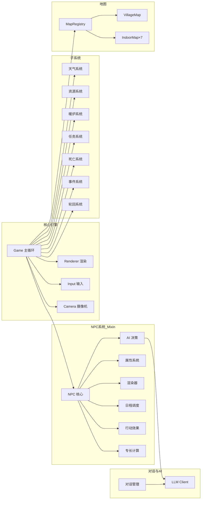

# 🏘️ 福音雪镇 (Gospel Snow Town) — 项目总览

> **灵感来源**: 星露谷物语 · 鹬鹕镇  
**技术路线**: 纯前端架构（HTML5 Canvas + Vanilla JS + LLM API）  
**模块化体系**: GST 命名空间 + IIFE 隔离 + Mixin 模式  
**LLM 支持**: GLM-4-Flash（云端）/ qwen3.5:4b、qwen3.5:9b via Ollama（本地，推荐）  
**核心目标**: 8 位 AI 居民的像素风末日雪镇生存游戏，4天极寒考验，居民能自主生活、社交、工作，玩家可以观察/对话  
**当前版本**: v4.18（系统性修复NPC弹弹乐死循环 + 日志增强 + 探索数值明确）
**项目路径**: `/data/project/project_revol/vibegame/20260305-gospel-snow-town`

---

## 📋 文档索引

| 文档 | 内容 | 说明 |
|------|------|------|
| [start.md](../start.md) | 🚀 启动说明 | 一键重启命令、文件结构、模块加载顺序 |
| [01-design.md](01-design.md) | 🎯 设计理念 | 项目定位、与 farm3/town 的关系 |
| [02-map.md](02-map.md) | 🗺️ 地图设计 | 村庄布局、7个室内场景、建筑入口、配色 |
| [03-npc.md](03-npc.md) | 👥 NPC 居民设计 | 8 个角色设定、专长、日程表、行动效果数值化、生存贡献闭环 |
| [04-attributes.md](04-attributes.md) | 📊 属性系统 | 五大属性（体力/San值/健康/饱腹/体温）+ 行动效果数值速查表 |
| [05-ai.md](05-ai.md) | 🤖 AI 系统 | Prompt 设计、对话系统、LLM 集成、环境感知系统 |
| [06-tech.md](06-tech.md) | ⚙️ 技术架构 | **v4.0 重构版** — 49个模块文件、7层分类、GST命名空间、Mixin模式 |
| [07-plan.md](07-plan.md) | 📅 开发计划 | 分期计划、待优化项 |
| [08-changelog.md](08-changelog.md) | 📝 更新日志 | v0.1~v4.15 完整版本历史 |
| [09-pitfalls.md](09-pitfalls.md) | 🚧 踩坑记录 | 53+ 条开发经验教训、48 条通用开发原则 |
| [10-module-testing.md](10-module-testing.md) | 🧪 模块测试方法论 | 测试工具使用、IIFE 编码规范速查、推荐工作流 |

---

## 🚀 快速开始

```bash
# 一键重启服务（推荐）
cd /data/project/project_revol/vibegame/20260305-gospel-snow-town
python3 tools/restart.py

# 访问游戏
http://localhost:8080
```

---

## 🏗️ v4.0 架构概览

v4.0 对原项目（26,700行单体代码）进行了全面模块化重构：

| 维度 | v3.x（重构前） | v4.0（重构后） |
|------|:---:|:---:|
| **JS文件数** | 14个（根目录平铺） | **49个**（7层分类） |
| **总行数** | 26,700 行 | **24,561 行** |
| **最大文件** | npc.js **8,370** 行 | npc-attributes.js 2,323 行 |
| **模块化** | ❌ 全局变量 | ✅ GST 命名空间 + IIFE |
| **数据分离** | ❌ 混在逻辑中 | ✅ `data/` 独立 7 个配置文件 |

### 源码目录结构

```
src/
├── core/     (6文件)  — 核心引擎（game/renderer/input/camera/constants/startup）
├── map/      (11文件) — 地图系统（base-map/village-map/indoor×7/map-registry）
├── npc/      (7文件)  — NPC系统 Mixin（npc核心+ai+属性+渲染+日程+效果+专长）
├── systems/  (8文件)  — 子系统（resource/furnace/weather/task/death/event/reincarnation/difficulty）
├── dialogue/ (2文件)  — 对话系统（dialogue-manager/dialogue-ui）
├── ai/       (3文件)  — AI/LLM（llm-client/llm-status/aimode-logger）
├── ui/       (1文件)  — UI（hud）
└── utils/    (3文件)  — 工具（pathfinding/sprite-loader/helpers）

data/         (7文件)  — 纯数据配置（NPC配置/日程/prompt/效果/地图/任务/事件）
```

### 设计原则

**SRP** 单一职责 · **OCP** 开闭原则 · **LSP** 里氏替换 · **ISP** 接口隔离 · **DIP** 依赖倒置 · **LoD** 迪米特法则 · **LKP** 最小知识

---

## 🎮 核心系统架构



### 8 位居民

| 角色 | 职业 | 专长特色 | 家庭关系 |
|------|------|----------|----------|
| 李婶 | 物资总管/炊事长 | 食物加工×2，物资盘点减浪费20%，分配公平 | 陆辰的妈妈 |
| 赵铁柱 | 伐木工/锅炉工 | 砍柴×1.5，搬运×1.5，暖炉维护×2 | — |
| 王策 | 技师/规划师 | 发电机维修×2，暖炉扩建×1.5，全队规划+10% | — |
| 老钱 | 镇长/精神领袖 | 调解冲突×2，安抚士气×2，经验预警 | 清璇的爷爷 |
| 苏岩 | 医官 | 治疗冻伤×2，失温救治+50%，半天采集食物，巡查安抚 | — |
| 陆辰 | 采集工/建筑工 | 建材×1.5，食物采集×1.3，建造×1.3，耐寒×0.7 | 李婶的儿子 |
| 歆玥 | 侦察员/急救兵 | 废墟侦察×2，野外急救×1.5，鼓舞士气×1.3 | — |
| 清璇 | 药剂师学徒/陷阱工 | 草药制剂×1.5，陷阱/警报，无线电修理 | 老钱的孙女 |